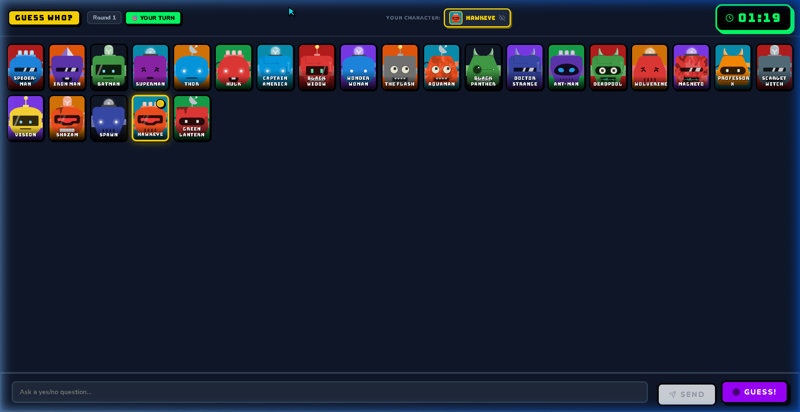
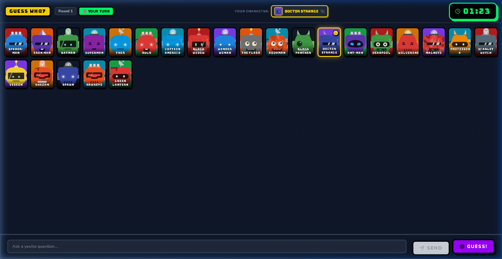

# Guess Who! — Web Edition



A fully playable **real-time 2-player Guess Who!** game running in the browser with WebSocket multiplayer. Both players see the same board of 24 characters, each secretly assigned one, and take turns asking yes/no questions to identify their opponent's character.

---

## 🚀 Technologies Used

**Frontend (Client)**
- **React 18** (Vite setup for lightning-fast HMR)
- **Vanilla CSS** with a modern *Neo-Brutalism* design system (thick borders, bold colors, and hard shadows)
- **Socket.io-client** for real-time WebSocket communication
- **Lucide React** for iconography
- **DiceBear API** for procedural character generation (12 distinct categories)

**Backend (Server)**
- **Node.js** & **Express**
- **Socket.io** for real-time bidirectional event-based communication
- **State Machine** handling game lobby, character selection, turn tracking, and 15-second answering timeouts

---

## 🧠 Game Logic

The backend uses a strict **State Machine** mapped to a `room` object to enforce the flow of the game:

1. **Waiting (`waiting`)**: The host generates a 4-character code. The game waits until exactly 2 players are connected.
2. **Category & Character Selection (`selecting`)**: 
   - The host chooses a category (e.g., *Superheroes*, *Monsters*, *Classic*). 
   - The server procedurally fetches 24 consistent avatars.
   - Both players must securely lock in their "Secret Character". The game only proceeds when both selections are confirmed.
3. **Playing (`playing`)**: 
   - The server enforces turns. Player 1 submits a Yes/No question.
   - Player 2 has **15 seconds** to reply (Yes/No). If they fail to reply, a timeout automatically answers "No".
   - Players use the interactive board to visually eliminate characters based on the answers.
   - On a player's turn, they can attempt to **Guess the Character**. If correct, they win! If wrong, the opponent wins.
4. **Finished (`finished`)**: The game reveals the characters, declares the winner, and offers a **Rematch** option without needing to recreate the lobby.

---

## 🎮 How to Play

1. **Create a Lobby**: Click *Host New Game*, enter your name, and share the 4-digit room code with your friend.
2. **Join the Lobby**: Your friend clicks *Join Game*, enters the code, and their name.
3. **Select Category**: The host picks the theme for the game board.
4. **Pick Your Character**: 
   
   Choose your secret character from the 24 options. Your opponent will be trying to guess this character!
5. **Ask Questions**: Take turns asking Yes/No questions (e.g., "Does your character wear glasses?").
6. **Eliminate Characters**: Click on characters on your board to toggle their opacity, narrowing down the possibilities.
7. **Guess to Win**: Once you're confident, click the "GUESS" button on a character to make your final attempt.

---

## 📁 Project Structure

```
Guess-who-website/
├── client/              React + Vite frontend
│   └── src/
│       ├── App.jsx              State machine + socket events
│       ├── index.css            Global styles (Neo-Brutalism)
│       ├── components/          UI Components (GameScreen, Lobby, etc.)
│       └── data/characters.js   Dynamic category generator
└── server/              Node.js + Express + Socket.io backend
    ├── index.js                 Socket events entry point
    └── gameLogic.js             Game state management
```

---

## 💻 How to Run Locally

### Requirements
- Node.js v16+
- npm or yarn

### 1. Start the Server
Open a terminal and start the backend:
```bash
cd server
npm install
node index.js
```
The server will start on port `3002`.

### 2. Start the Client
Open a new terminal window for the frontend:
```bash
cd client
npm install
npm run dev
```
The client will start on port `5173`.

Open your browser to `http://localhost:5173`.

### Environment Variables (.env)
A `.env` file can be configured in both `server/` and `client/` directories:
- **Server (`server/.env`)**:
  `PORT=3002`
  `CLIENT_ORIGIN=http://localhost:5173`
- **Client (`client/.env`)**:
  `VITE_SERVER_URL=http://localhost:3002`

---

## License
MIT
